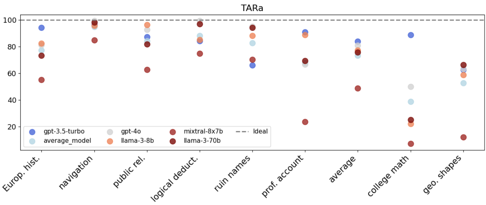

# Cyber Linguistics
## In an era when machines speak, language is no longer just human

Breck Baldwin, *w;AI (with AI)* — GPT-4o
August 14, 2025
NIST AI Metrology Colloquium Series

---

# Outline

- The Limerick
- Gratitude and Acknowledgment
- Experimental Results on LLM Determinism
    + Determinism for LLMs
    + Mid talk conclusions
- Why Cyber Linguistics?
- Pragmatics: Bringing Chomsky to a Grice Fight
- Conclusions

---

# Breck’s opining on AI down at NIST,
# Cyber Linguistics is top of the list.
# Though Chomsky looms large,
# Grice should be in charge—
# And determinism? It doesn’t exist.

---

# Gratitude and Acknowledgement

- NIST is one of two Federal organizations I owe (DARPA is the other)
   + MUC-6/7, TIPSTER, TREC, DUC
- Evaluation matters
    + "The MUCs are notable, however, in that they in large part have shaped the research program in information extraction and brought it to its current state" Grisham/Sundhiem 1996
- Downstream effects
    + Explosion of structured evals
        - Was: Extraction/Coreference/IR/Summarization
        - Is: Multiple choice, humor, world knowledge...
---

# But We have Lost Ground

Non-Determinism of "Deterministic" LLM Settings: https://arxiv.org/abs/2408.04667

Berk Atil, Sarp Aykent, Alexa Chittams, Lisheng Fu, Rebecca J. Passonneau, Evan Radcliffe, Guru Rajan Rajagopal, Adam Sloan, Tomasz Tudrej, Ferhan Ture, Zhe Wu, Lixinyu Xu, Breck Baldwin

- TL;DR Hosted LLMs are very non-Deterministic

---
# Initial Data and Metrics

- 8 multiple choice tasks (100 to 282 questions)
    + BBH: navigation, ruin names, geometric shapes, logical deduction 3 objects
    + MMLU: European history, college math, professional accounting, public relations
- Run 10 times--deterministic settings
- TARr: Total Agreement Rate raw (bytes): 
    + Counts how many responses had the same bytes across 10 runs
- TARa: Total Agreement Rate answer (parsed answer): 
    + Agree: "The answer is A" == "A is the answer"
    + Counts how many questions had the same answer across 10 runs
    + Agnostic about correctness of answer
---

---
# Consequences of Non-determinism at Byte Level

- Unit testing no longer possible as commonly done
- 80:20 Rule broken
- System complexity increase
---

---
# How about Accuracy?

- Best Possible, Median, Worst Possible Accuracy over 10 runs

---
# But Nobody Cares...

Cause: 
- Trivial fix is to run single batch
- Likely mechanism is packing inputs to LLMs on hosted instances
- No evidence of GPU instability
- Powerful economic motivators to pack jobs

"Not caring" evidence:
- Developers act like I am telling them to floss daily
- Hosting companies have not prioritized or promoted determinism
- Llama.cpp has open issues around this

---
# But Why is Non-determinism Tolerated? 
- Benchmark numbers are for marketing, not engineering
- Randomness helps with the reality/perception of intelligence:

    "...if we dial back all sources of randomness within our current large language models (LLMs) they will also act deterministically, albeit in fairly unknowable ways. This, however, isn't how we use AI. We deliberately include randomness because it's that aspect that leads to interesting and new behaviour. We want AI to do things that would previously have required a human user, and this has significant consequences." From Dave Hudson's [Blog](https://davehudson.io/blog/2025-08-11): 

- Humans are primary consumers of LLM outputs and are robust to non-determinism
- To achieve AGI it's LLMs all the way down. They will create determinism if they need it.

---

# Mid-talk Conclusions

- Determinism does not exist across any task/model
- The impact on accuracy (performance) can be profound
- Nobody cares...hopefully NIST does
---

---

# Engineering with LLMs

- LLMs have stabilized as an amazing technology, but...
    + Language in/language out
    + Schemas are still defined in language terms
    + Poorly behaved neighbors to OSs, DBs, APIs
- LLMs must transition to being one of many tools in system building
    + Understandability
    + Reliability
    + Stability
- Put a name to the pain: "Cyber Linguistics"

---

# What's missing from current LLM theory?

Some starting points:

+ Appropriate evaluation and metrics
+ Calibration
+ Reasoning with stochastic processes
    - Unit testing
    - Is the process truly stochastic?
+ "Old School" infrastructure to help with theory
    - Theory of computation: Prompt x inference -> Expected response
    - Classes of logics
    - Pragmatics

---

# Bringing Chomsky to a Grice Fight

---
# College Math: 100 Questions x GPT-4o (Toy Problem)

- `Prompts`:
    + `Generic = GENERIC         + COMMON_SUFFIX + question`
    + `Grice   = GRICE_PREFIX    + COMMON_SUFFIX + question`
    + `Chomsky = CHOMSKY_PREFIX  + COMMON_SUFFIX + question`
    + `Schema  = JSON_PREFIX     +                 question`
    + `Raw     =                                   question`

---
# Prefix Prompts
- `GENERIC` = "Please answer the following question,"
- `GRICE_PREFIX` = "Please answer the following question while adhering to Gricean Maxims: Particularly the Maxim of Manner: Be clear—avoid obscurity and ambiguity, be brief and orderly. A bit more context,"
- `CHOMSKY_PREFIX` = "Please answer the following question while adhering to Chomsky’s Competence–Performance distinction: Maximize knowledge (competence) and minimize performance errors. A bit more context,"

---
# Prompts continued

-`COMMON_SUFFIX` = " this is a multiple choice question and there is no benefit to the grade in showing your work. You are also being scored on the consistency of the answer you give over multiple runs so it is suggested you keep your answer to a single letter from A, B, C, D and E and reason conservatively to maximize the chance of giving the same answer across multiple runs of the same question. The question is: " 

---

---
# Removal algorithm

Remove rubric from round n + 1 if output round n != first round
+ `Str` + prompt : Exact string/byte match
+ `Answ` + prompt : Parsed answer match

---

---

---

---
### Clear Length to Accuracy/Determinism Link... until Chomsky Showed Up
| Condition | Answ Tok Len | Str Deter | Answ Deter | % Acc Run 0 |
| --------- | ------------ | --------- | ---------- | ----------- |
| Grice     | 1            |   Middle  |  Best      |         44% |
| Schema    | 13           |   Best    |  Best      |         47% |
| Generic   | 1-100+       |   Low     |  Middle    |         58% |
| Raw       | 100+         |   Worst   |  Worst     |         56% |
|           |              |           |            |             |
|           |              |           |            |             |
| Chomsky   | 100+         |   Worst   |  2nd Worst |         74% |

---
# Observations--Remember Toy Problem
- Grice mattered--one token, best answer determinism, worst accuracy
    + Remember that `COMMMON_SUFFIX` had all the constraints
- Schema mattered-- 13 tokens, best string and answer determinism, worst accuracy
- Generic/Raw-- varied tokens, a middling mess
- Shorter-> more deterministic
- Longer-> more/better inference
- Chomsky mattered: 
    + Mention Chomsky and beat Grice by 30%???

---
# Conclusions

- Exciting times
- Determinism does not exist for LLMs in practice
    + Nobody cares but should
- Need a new field "Cyber Linguistics"
    + Make LLMs engineerable components
    + Bring existing domains, like pragmatics, to help

---

### Chomsky always wins

---

- Anyone wanting to participate in Cyber Linguistic activity please reach out
    + Manifesto--written by GPT-4o
        - https://www.linkedin.com/pulse/long-road-agi-cyber-linguistics-breck-baldwin-tm36e/
    + ??Journal??
    + Contributing experiments

All data/software is available off of my splash page: https://breckbaldwin.github.io